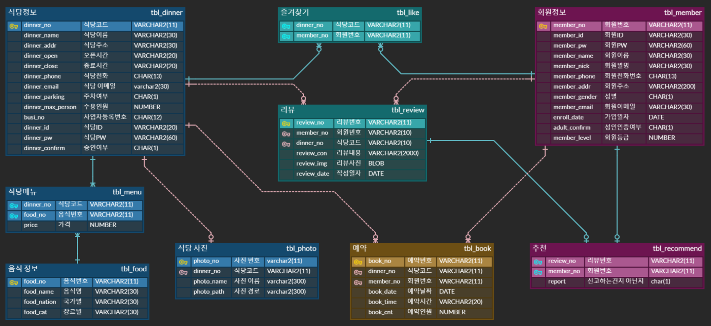

# Menu Pick 📍

A full-stack `Java web application` that allows customers and restaurant owners to
search for restaurants, make or manage reservations and leave reviews.

## Table of Contents

- [Features](#features)
- [Tech Stack](#tech-stack)
- [ERD](#erd)
- [Development Environment](#development-environment)

---

## Features

### Customers

- Search restaurants using a map and current location
- Search restaurants using restaurant name and menu
- Write reviews
- Add restaurants to favorites

### Restaurant Owners

- Create restaurant owner account
- Check reservations using calendar UI
- Send email when canceling reservation

### Administrators

- Manage accounts levels
- Manage reviews
- Edit restaurant's thumbnail image

### Account Management

- Recover forgotten IDs using email
- Reset passwords through account recovery process
- Hash passwords using `BCrypt` before storing them in the database

---

## Tech Stack

### Front-end

- HTML
- CSS
- JavaScript
- jQuery
- AJAX

### Back-end

- Java
- Lombok
- JSP & Servlets

### Database

- Oracle Database

### Server

- Apache Tomcat

### External APIs

- [Naver Cloud platform Email API](https://api.ncloud-docs.com/docs/en/ai-application-service-cloudoutboundmailer)
- [Kakao Map API](https://apis.map.kakao.com/)

---

## ERD

Designed using [ERD Cloud](https://erdcloud.com)

---

## Development Environment

Follow instructions in
[unemotioned/bulletin-board](https://github.com/unemotioned/bulletin-board)
to set up development environment.
